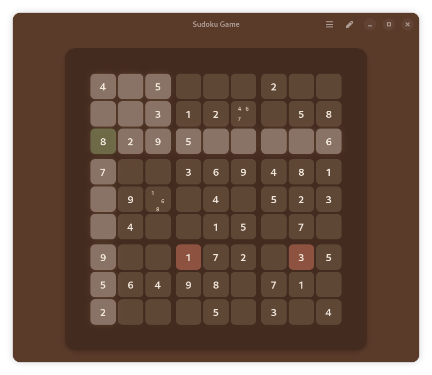

[license-url]: https://github.com/sepehr-rs/Sudoku/blob/master/COPYING
[license-image]: https://img.shields.io/github/license/sepehr-rs/sudoku.svg?style=for-the-badge
[issues-url]: https://github.com/sepehr-rs/Sudoku/issues
[issues-image]: https://img.shields.io/github/issues/sepehr-rs/Sudoku?style=for-the-badge
[flathub-url]: https://flathub.org/apps/io.github.sepehr_rs.Sudoku
[flathub-image]: https://img.shields.io/flathub/v/io.github.sepehr_rs.Sudoku?logo=flathub&style=for-the-badge
[installs-image]: https://img.shields.io/flathub/downloads/io.github.sepehr_rs.Sudoku?style=for-the-badge
[persian-gnome-badge]: https://gnome-fa.github.io/assets/badges/persian-gnome.svg
[persian-gnome-url]: https://gnome_fa.t.me/

  

  # Sudoku

  **Solve puzzles in style**

  [![Persian GNOME][persian-gnome-badge]][persian-gnome-url]

  [![License][license-image]][license-url]
  [![Flathub][flathub-image]][flathub-url]
  [![Issues][issues-image]][issues-url]
  [![Installs][installs-image]][flathub-url]

  

## Description

Sudoku is a puzzle app that lets you solve classic number-placement challenges. It features a clean, distraction-free design with a simple interface to keep you focused and engaged.

## Features
- Modern GTK4 and libadwaita interface
- Keyboard shortcuts for quick access to all functions
- Save and load games seamlessly to continue your progress anytime
- Highlight active row and cell to improve focus and ease of play
- Conflict highlighting to help identify mistakes, ideal for beginners
- Suitable for all skill levels, from beginners to experts

## Install

## Download from Flathub

### Build from source
You can clone and run from GNOME Builder.

## Contribute
We need your help to make Sudoku better!
There are lots of features that can be added, and we would love to see your contributions. Please read our [contribution guidelines](CONTRIBUTING.md) for further info.

If you want to contribute to this project, you can fork the repository and submit a pull request. You can also report a bug or request a feature by opening an issue.

Your contributions are extremely welcome and appreciated.

## Credits

Developed by **[SepehrRS](https://github.com/sepehr-rs)** & **[Revisto](https://github.com/revisto)**

## License
This program is free software: you can redistribute it and/or modify it under the terms of the GNU General Public License as published by the Free Software Foundation, either version 3 of the License, or (at your option) any later version.

## Code of Conduct
We follow the [GNOME Code of Conduct](https://wiki.gnome.org/Foundation/CodeOfConduct) to ensure a welcoming environment for everyone. Be kind, be respectful, and help us build something awesome and fun together. 
