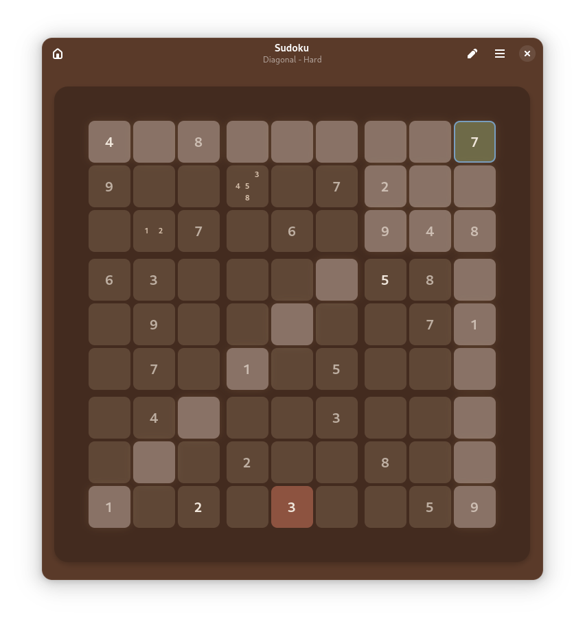

[license-url]: https://github.com/sepehr-rs/Sudoku/blob/master/COPYING
[license-image]: https://img.shields.io/github/license/sepehr-rs/sudoku.svg?style=for-the-badge
[issues-url]: https://github.com/sepehr-rs/Sudoku/issues
[issues-image]: https://img.shields.io/github/issues/sepehr-rs/Sudoku?style=for-the-badge

  

  # Sudoku

  **Solve Sudoku puzzles**

  [![License][license-image]][license-url]
  [![Issues][issues-image]][issues-url]

  

## Description

Sudoku is a modern Sudoku app focused on delivering a clean, distraction-free experience. Designed with simplicity and comfort in mind, it features a straightforward interface that helps players stay focused and enjoy the game without unnecessary clutter or complications.

## Features
- Modern GTK4 and libadwaita interface
- Keyboard shortcuts for quick access to all functions
- Save and load games seamlessly to continue your progress anytime
- Highlight active row and cell to improve focus and ease of play
- Conflict highlighting to help identify mistakes, ideal for beginners
- Suitable for all skill levels, from beginners to experts

## Install

## Download from Flathub

### Build from source
You can clone and run from GNOME Builder.

## Contribute
We need your help to make Sudoku better!
There are lots of features that can be added, and we would love to see your contributions.

If you want to contribute to this project, you can fork the repository and submit a pull request. You can also report a bug or request a feature by opening an issue.

Your contributions are extremely welcome and appreciated.

## Credits

Developed by **[SepehrRS](https://github.com/sepehr-rs)** & **[Revisto](https://github.com/revisto)**

## License
This program is free software: you can redistribute it and/or modify it under the terms of the GNU General Public License as published by the Free Software Foundation, either version 3 of the License, or (at your option) any later version.

## Code of Conduct
We follow the [GNOME Code of Conduct](https://wiki.gnome.org/Foundation/CodeOfConduct) to ensure a welcoming environment for everyone. Be kind, be respectful, and help us build something awesome and fun together. 
